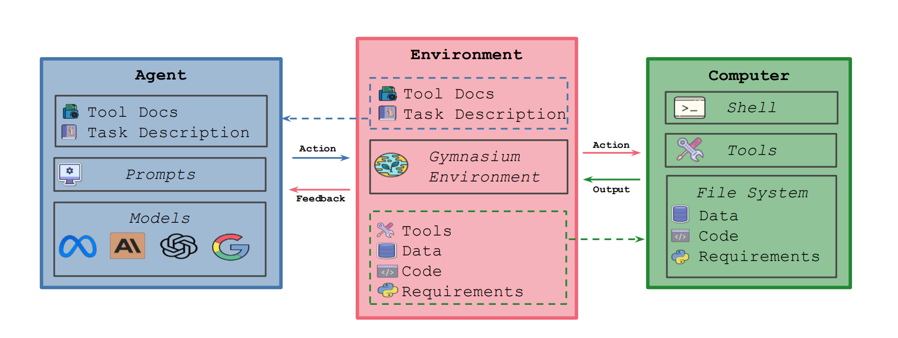

<p align="center">
    
</p>

<p align="center">
  <a href="https://creativecommons.org/licenses/by-nc/4.0/"></a>
  <!-- Someone else has pypi package with the same name -->
  <!-- <a href="https://pepy.tech/project/mlgym"></a> -->
  <!-- <a href="https://github.com/facebookresearch/minihack/actions/workflows/test_and_deploy.yml"></a> -->
  <a href="https://arxiv.org/abs/2502.14499"></a>
 </p>

## Table of contents

* [Introduction](#introduction)
* [Installation](#installation)
* [Quick Start](#quick-start)
* [Trajectory Visualizer](#trajectory-visualizer)
* [Contributions and Maintenance](#contributions-and-maintenance)
* [License](#license)

## Introduction

This is the first Gym environment for machine learning (ML) tasks, enabling research on reinforcement learning (RL) algorithms for training such agents. <span style="font-variant:small-caps;">MLGym</span>-Bench consists of 13 diverse and open-ended AI research tasks from diverse domains such as computer vision, natural language processing, reinforcement learning, and game theory. Solving these tasks requires real-world AI research skills such as generating new ideas and hypotheses, creating and processing data, implementing ML methods, training models, running experiments, analyzing the results, and iterating through this process to improve on a given task.


> [!WARNING]
> Meta <span style="font-variant:small-caps;">MLGym</span> is currently an experimental framework intended for benchmarking AI Research Agents. It is under heavy development. Please except major changes to the design.
>
> The primary goal of <span style="font-variant:small-caps;">MLGym</span> is to expand the selection of AI research tasks for benchmarking the LLM Agents and implementing RL algorithms to train LLMs in a research environment.
> `main` branch will always contain the latest stable release and all breaking changes will be announced in the [release notes](./CHANGELOG.md).

## Installation

1. Clone and install dependencies

    ```bash
    git clone git@github.com:facebookresearch/MLGym.git
    cd MLGym
    conda create -y -n mlgym python=3.11
    conda activate mlgym
    pip install -e .
    ```

2. Create a `.env` file in the MLGym directory (`MLGym/.env`) to save all the environment variables including API keys.

    ```bash
    # Env variables
    MLGYM_CONFIG_ROOT="<path_to_MLGYM_root>/configs"
    MLGYM_TASK_CONFIG_DIR="<path_to_MLGYM_root>/configs/tasks"
    MLGYM_WORKSPACE_PATH="<path_to_MLGYM_root>/workspace"
    MLGYM_ENV_TIMEOUT=10000
    MLGYM_ACTION_SHORT_TIMEOUT=60
    MLGYM_ACTION_LONG_TIMEOUT=10000
    MLGYM_MODEL_MAX_RETRIES=3

    # API keys
    OPENAI_API_KEY=""
    ANTHROPIC_API_KEY=""
    ```

3. You can use either Docker or Podman to run tasks inside a container. Podman is the recommended way to run containers on macOS.

4. Follow the instructions [here](https://docs.docker.com/desktop/) to install docker. Select the appropriate installation command based on your OS.

5. If you are working on a Linux machine, please install the `nvidia-container-runtime`. This is required to start docker containers with GPU support.

    ```bash
    sudo dnf install -y nvidia-container-toolkit
    ```

6. **Please skip to step 9 if you don't want to use Podman**.

7. For Linux:  
    a. Follow the instructions [here](https://podman.io/get-started) to install Podman.  
    b. Start podman socket. The last command should return a running podman socket:

    ```bash
    systemctl --user enable podman.socket
    systemctl --user start podman.socket
    systemctl --user status podman.socket 
    ```

    c. Redirect docker host to podman by exporting docker host env variable in bashrc or current session:

    ```bash
    export DOCKER_HOST=unix:///run/user/$UID/podman/podman.sock
    ```

8. For MacOS:  
    a. If you use Homebrew package manager, install Podman with `brew install podman`. Otherwise, follow the instructions [here](https://podman.io/get-started).  
    b. Start the podman machine and set the docker host env variable:
    ```bash
    podman machine init
    podman machine start
    export DOCKER_HOST=http+unix://$(podman machine inspect --format '{{.ConnectionInfo.PodmanSocket.Path}}')
    ```

9. Pull the container image:

    ```bash
    docker pull aigym/mlgym-agent:latest
    ```

    or  
    ```bash
    podman pull aigym/mlgym-agent:latest
    ```

10. Test launching a docker/podman container with GPU support

    ```bash
    docker run -it --gpus all --name test aigym/mlgym-agent /bin/bash
    ls -la
    exit
    ```

11. Check that GPUs are available in the docker container using `nvidia-smi`.

### Troubleshooting

If you get Nvidia CDI spec errors on linux (eg. `Error: setting up CDI devices: unresolvable CDI devices nvidia.com/gpu=all`), run these additional commands.

```bash
sudo mkdir /etc/cdi
sudo nvidia-ctk cdi generate --output=/etc/cdi/nvidia.yaml
sudo touch /etc/containers/nodocker
```

## Quick Start

### Docker

```bash
python run.py \
  --container_type docker \
  --task_config_path tasks/battleOfSexes.yaml \
  --model litellm:claude-3-5-sonnet-20240620 \
  --per_instance_cost_limit 4.00 \
  --agent_config_path configs/agents/default.yaml \
  --temp 1 \
  --gpus 0 \
  --max_steps 50 \
  --aliases_file ./docker/aliases.sh
```

### Podman

```bash
python run.py \
  --container_type podman \
  --task_config_path tasks/battleOfSexes.yaml \
  --model litellm:claude-3-5-sonnet-20240620 \
  --per_instance_cost_limit 4.00 \
  --agent_config_path configs/agents/default.yaml \
  --temp 1 \
  --gpus 0 \
  --max_steps 50 \
  --aliases_file ./docker/aliases.sh
```

To see a full list of flags, please run `python run.py --help`.

> [!NOTE]
> A detailed documentation for all parts of the <span style="font-variant:small-caps;">MLGym</span> framework is under construction. Please stay tuned!

## Trajectory Visualizer

<span style="font-variant:small-caps;">MLGym</span> provides a Web UI to inspect the agent trajectories.

```bash
streamlit run demo/trajectory_visualizer.py -- --trajectory_dir <absolute_path_to_trajectories>

# An example
streamlit run demo/trajectory_visualizer.py -- --trajectory_dir $HOME/Projects/MLGym/trajectories/mlgym_bench_v0
```

To run the demo for <span style="font-variant:small-caps;">MLGym</span>, use the following command:

```bash
streamlit run demo/demo.py
```

## Contributions and Maintenance

<span style="font-variant:small-caps;">MLGym</span> was built and is maintained by [GenAI at Meta](https://ai.meta.com/) and [UCSB NLP](http://nlp.cs.ucsb.edu/). We welcome contributions to <span style="font-variant:small-caps;">MLGym</span>. If you are interested in contributing, please see [this document](./CONTRIBUTING.md). Our maintenance plan can be found [here](./MAINTENANCE.md).

## Citation

If you find this work helpful, please consider citing us using the following:

```tex
@misc{nathani2025mlgymnewframeworkbenchmark,
      title={MLGym: A New Framework and Benchmark for Advancing AI Research Agents}, 
      author={Deepak Nathani and Lovish Madaan and Nicholas Roberts and Nikolay Bashlykov and Ajay Menon and Vincent Moens and Amar Budhiraja and Despoina Magka and Vladislav Vorotilov and Gaurav Chaurasia and Dieuwke Hupkes and Ricardo Silveira Cabral and Tatiana Shavrina and Jakob Foerster and Yoram Bachrach and William Yang Wang and Roberta Raileanu},
      year={2025},
      eprint={2502.14499},
      archivePrefix={arXiv},
      primaryClass={cs.CL},
      url={https://arxiv.org/abs/2502.14499}, 
}
```

## License

The majority of this code is licensed under CC-BY-NC 4.0 (Attribution-NonCommercial 4.0 International) license. However portions of the project are available under separate license terms: [SWE-Agent](https://github.com/SWE-agent/SWE-agent?tab=MIT-1-ov-file) and [Modded-NanoGPT](https://github.com/KellerJordan/modded-nanogpt?tab=MIT-1-ov-file) are released under MIT license; [Gymnax](https://github.com/RobertTLange/gymnax?tab=Apache-2.0-1-ov-file) and [Gymnax-blines](https://github.com/RobertTLange/gymnax-blines?tab=Apache-2.0-1-ov-file) are released under Apache 2.0 License.
